# 🖐️ NEXA AIR

### AI Hand Gesture Tracking & Computer Vision Application

> An Android-based AI computer-vision application that uses CameraX and MediaPipe Hand Landmarker to detect, track, and recognize hand gestures in real time.


---

# 📖 About NEXA AIR

NEXA AIR is an Android-based artificial intelligence and computer-vision application designed to detect, track, and recognize human hand gestures in real time using a smartphone camera.

The application combines **Android development, CameraX, MediaPipe Hand Landmarker, landmark-based gesture classification, and custom real-time visualization** to transform a smartphone camera into an intelligent hand-tracking system.

NEXA AIR currently recognizes five primary gestures:

- 🖐️ Open Palm
- ✊ Fist
- ☝️ Point
- 👍 Thumbs Up
- ✌️ Peace

The application also provides real-time gesture confidence, FPS, processing latency, tracking status, hand landmarks, and visual tracking feedback.

The project is designed with a modular computer-vision architecture so that additional gestures and advanced interaction capabilities can be introduced in future releases.

---

# ✨ Features

## 🖐️ AI Hand Tracking

- Real-time hand detection
- 21-point hand landmark detection
- Continuous camera-frame processing
- Real-time landmark updates
- Hand tracking visualization
- Tracking status feedback

## ✋ Gesture Recognition

NEXA AIR currently supports:

- 🖐️ Open Palm
- ✊ Fist
- ☝️ Point
- 👍 Thumbs Up
- ✌️ Peace

The recognition system also supports:

- `UNCERTAIN` — when a hand is detected but the configuration cannot be confidently classified
- `NONE` — when no supported gesture or valid tracking state is detected

## 📊 Real-Time Tracking Metrics

- Gesture confidence percentage
- FPS monitoring
- Processing latency
- Tracking status
- Sensitivity information

## 🎯 Calibration

- Hand positioning verification
- Lighting condition checks
- Tracking readiness
- Camera availability
- Visual calibration guidance

## ⚙️ Tracking Controls

Users can customize:

- Landmark visibility
- Hand mask visibility
- Confidence display
- FPS display
- Camera mirroring
- Tracking sensitivity

## 📚 Gesture Library

A dedicated Gesture Library provides information about the five supported gestures with individual gesture cards, icons, descriptions, and visual presentation.

## 💾 Persistent Settings

User tracking preferences are stored locally using **SharedPreferences** through the application's `Prefs` utility.

---

# 🎨 Premium User Interface

NEXA AIR follows a professional dark AI/computer-vision design language built around its green visual identity.

### 🎨 Visual Design

- 🌑 Dark futuristic interface
- 🟢 NEXA AIR green visual identity
- ✨ Glowing tracking elements
- 🟢 Green hand skeleton visualization
- 🔘 Glowing landmark points
- 🖐️ Translucent hand mask
- 📦 Rounded professional cards
- 🎛️ Modern controls
- 📊 Real-time status indicators
- 🎬 Smooth UI animations
- 📱 Responsive Android layouts

The primary visual identity uses a dark background with bright green tracking elements to visually connect the user interface with the application's AI vision system.

The main background uses a color close to:

`#070B0F`

The primary NEXA AIR green is:

`#38F27F`

---

# 📸 Application Preview

The screenshots below showcase the major screens and computer-vision capabilities of NEXA AIR.

> Place your screenshots inside the `screenshots/` folder using the filenames shown below.

---

## 🚀 Splash Screen

The NEXA AIR splash screen introduces the application with its dark futuristic branding, AI hand-tracking identity, green visual effects, and loading animation.

<p align="center">
  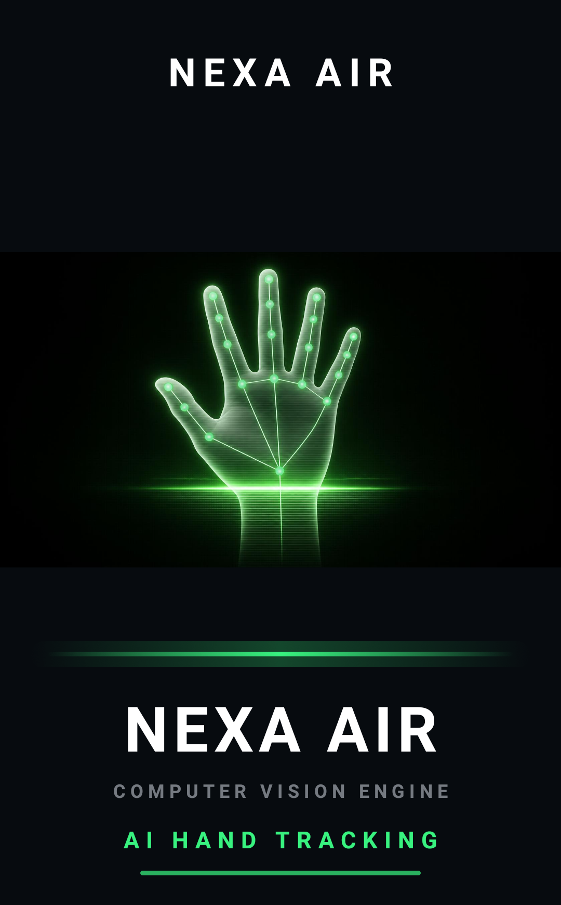
</p>

---

## 🏠 Home Dashboard

The Home screen acts as the central dashboard and provides navigation to the application's main functionality.

<p align="center">
  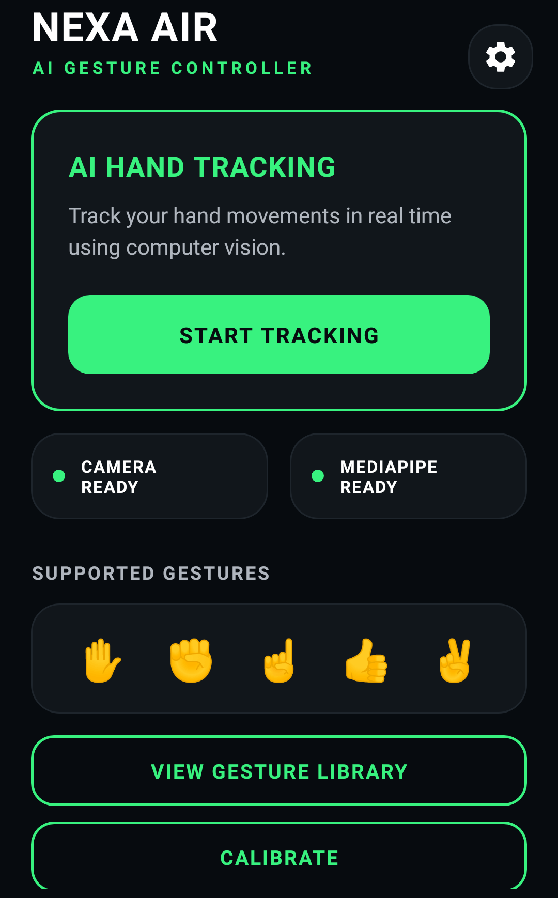
</p>

---

## 🖐️ Real-Time Gesture Tracking

The Gesture Tracking screen combines the CameraX preview, MediaPipe hand detection, gesture classification, and custom hand overlay.

<p align="center">
  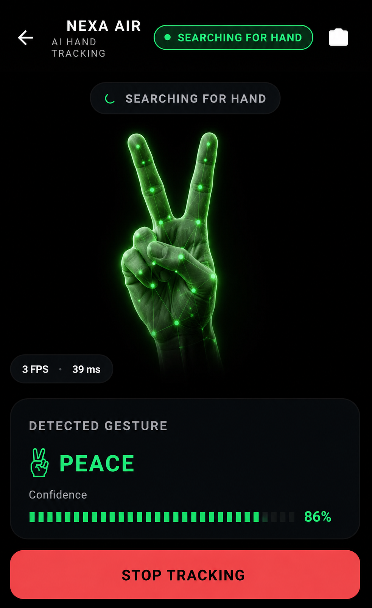
</p>

---

## 📚 Gesture Library

The Gesture Library presents the supported gestures and provides information about each gesture.

<p align="center">
  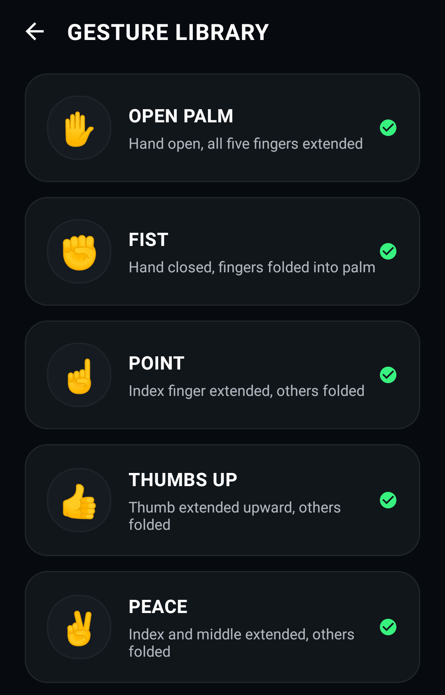
</p>

---

## 🎯 Calibration

The Calibration screen helps users prepare the camera, hand position, lighting conditions, and tracking environment.

<p align="center">
  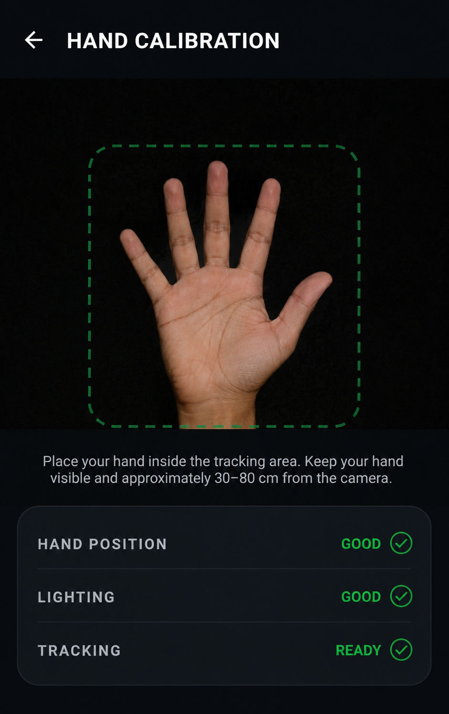
</p>

---

## ⚙️ Settings

The Settings screen allows users to customize the tracking experience and visualization options.

<p align="center">
  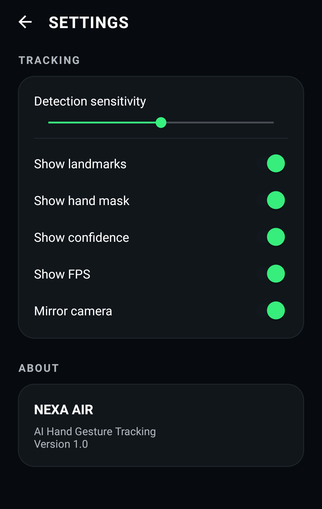
</p>

---

## ✋ Supported Gestures

| Open Palm | Fist | Point | Thumbs Up | Peace |
|:---:|:---:|:---:|:---:|:---:|
| 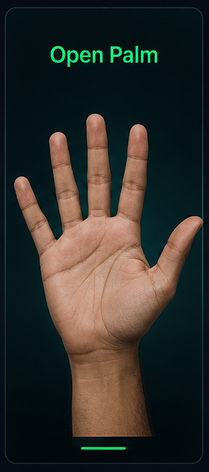 | 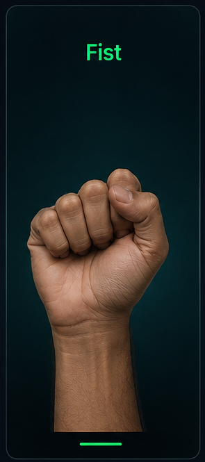 | 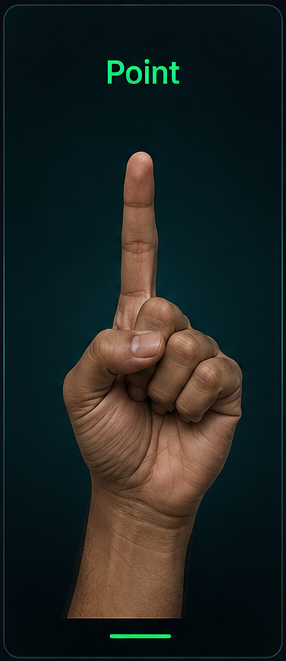 | 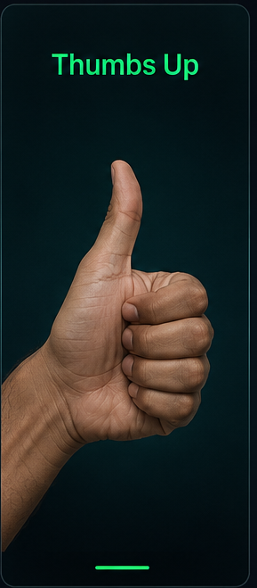 | 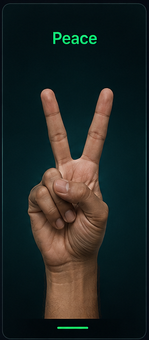 |

---

# 🛠 Technology Stack

## 📱 Android Development

- Java
- XML
- Android Studio
- Android SDK
- AndroidX
- Gradle
- ConstraintLayout
- Material Components
- ViewBinding

## 📷 Camera & Computer Vision

- CameraX
- CameraX Preview
- CameraX Image Analysis
- MediaPipe
- MediaPipe Tasks Vision
- MediaPipe Hand Landmarker
- 21 Hand Landmarks
- Landmark-based Gesture Classification

## 🎨 UI & Graphics

- XML Layouts
- Material Design
- Custom Views
- Canvas Rendering
- Paint-based Visualization
- Vector Drawables
- XML Drawables
- UI Animations
- Custom Hand Overlay

## 💾 Local Storage

- SharedPreferences
- Custom `Prefs` Utility

## 🧰 Development Tools

- Android Studio
- Git
- GitHub
- Gradle
- Java Development Kit

---

# 🏗 Architecture

NEXA AIR uses a modular real-time computer-vision processing pipeline that separates camera management, AI hand detection, gesture classification, result handling, and UI visualization.

```text
CameraX
   ↓
CameraManager
   ↓
Camera Frames
   ↓
HandLandmarkerHelper
   ↓
MediaPipe Hand Landmarker
   ↓
21 Hand Landmarks
   ↓
GestureClassifier
   ↓
GestureResult
   ↓
GestureTrackingActivity
   ↓
HandOverlayView + UI
```

---

# 📦 Download APK

Experience **NEXA AIR** directly on your Android device without opening Android Studio.

Download the latest APK release and explore the application's real-time hand tracking, AI-powered gesture recognition, MediaPipe Hand Landmarker integration, CameraX-based computer vision, live performance monitoring, and professional Android interface.

| Information    | Details                          |
| -------------- | -------------------------------- |
| 📦 Version     | v1.0                             |
| 📱 Platform    | Android                          |
| ⚙️ Minimum SDK | API 24                           |
| 🛠 Built With  | Java & XML                       |
| 🧠 AI Vision   | MediaPipe Hand Landmarker        |
| 📷 Camera      | CameraX                          |
| 🖐️ Tracking    | 21-Point Hand Landmark Detection |
| ✋ Gestures    | 5 Recognized Gestures            |
| 📅 Release     | August 2026                      |

<p align="center">

<a href="PASTE_RELEASE_LINK_HERE">
  
</a>

</p>

> **Note:** NEXA AIR requires camera access for hand tracking and gesture recognition. Android may display a security warning when installing an APK downloaded outside Google Play.
